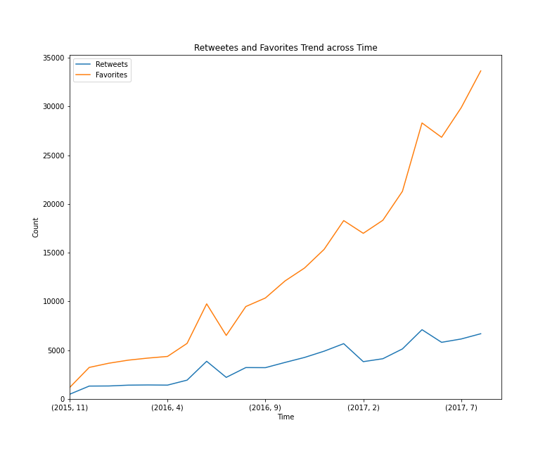

# Analysis and Insights of WeRateDogs Twitter Archive:

## Tweeting Trend of WeRateDogs:

The number of tweets posted by WeRateDogs decreased drastically across time. We can infer that from the graph that number of tweets WeRateDogs tweeted in 2015 are far more than 2017.
 
 
 
 
 
 
 
 
 
 
 
 
 
 
 
 
## Rating Distribution:

__We can see that most the dogs are rated 12 and next 10. the highest rating got is 1776 and the second highest rating is 420.__

__The name of the dog with highest rating is Atticus__ 

__The name of the dog(sarcastically) with second highest rating is Snoop Dogg__

 

 
 
 
 
 
 
 
 
 
 
 
 
 
 
 

## Retweet and Favourite Trend:

The favorite count trend shows higher increase in trend compared to retweet count trend.

## Top 5 common Dog Names:

These are the top 5 common dog names. We can infer that 10 dogs are named as __Charlie__ and __Oliver__ and __Cooper__. There are 9 dogs name __Lucy and Tucker__.

## Mean Retweet and Favorite counts in Dog_stages:

__(Rounded to nearest integer)__

| Dog Stage | Retweet count | Favorite Count |
| ---- | ------ | ----- |
| Doggo | 6194 |  17642 |
| Floofer | 4347 | 12028 |
| Pupper | 2026 | 6437 |
| Puppo | 5770 | 21130 |

